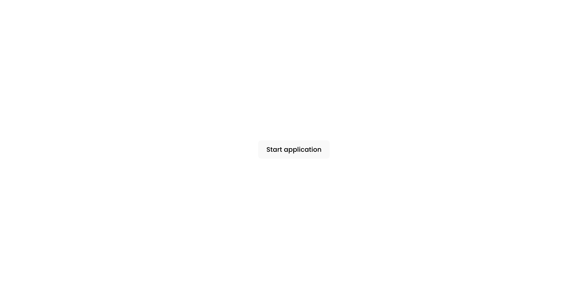
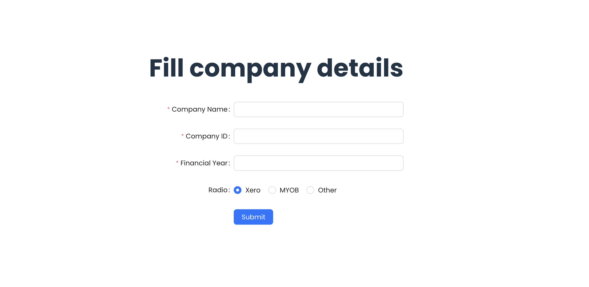
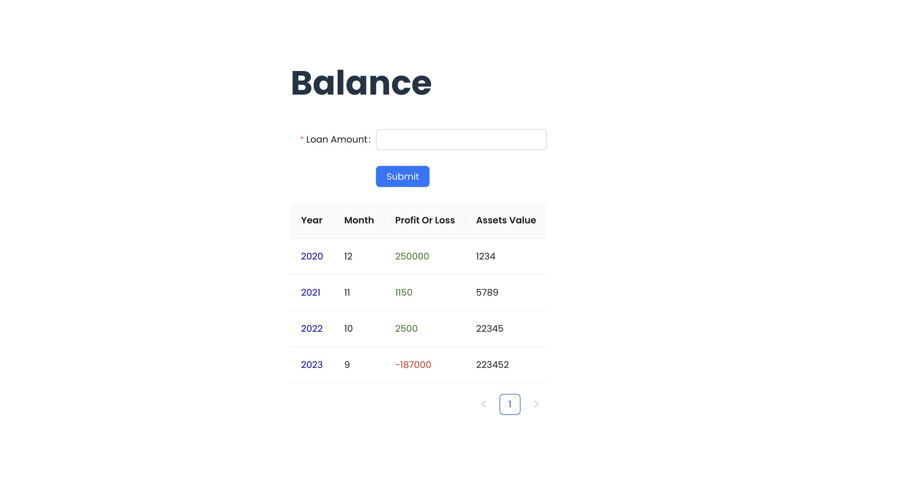

# Demyst Code-kata task

This repository contains the code for the Demyst-code-kata task, which is a full stack business loan application system.

The link to the task is [here](https://github.com/DemystData/code-kata/blob/main/README.md)

To run the application:

```
  docker-compose up
```

## Screenshots





## Tech Stack

**Client:** React, Redux, Ant-design, Typescript

**Server:** Node, Express, Typescript
